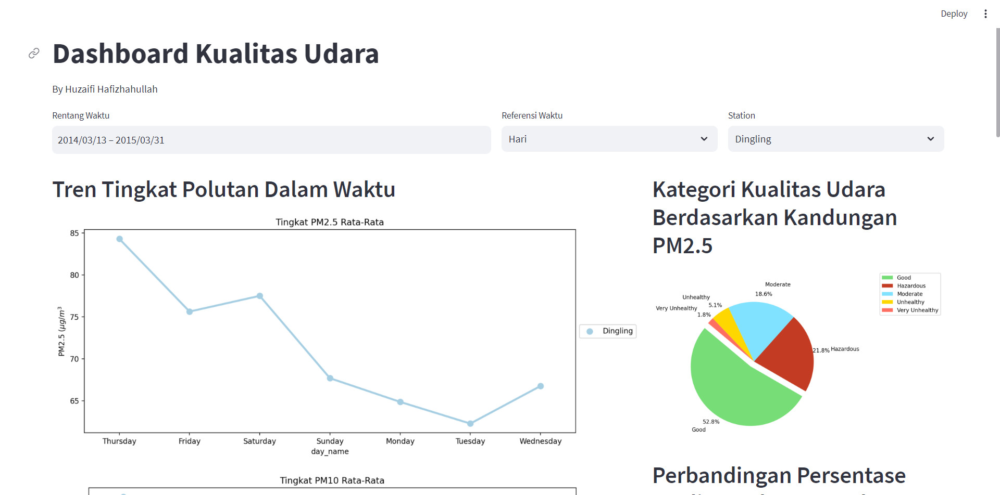

# Air Quality Dashboard
## Overview
The Air Pollution Dashboard provides visualizations of air quality data collected from various stations.
Users can customize the data view by selecting a date, time unit, and station.


Dashboard Access: [Streamlit](https://air-quality.streamlit.app/)




## Features
- View air pollution data in graphical format.
- Customize data view by selecting date, time unit, and station.
- Interactive charts for detailed analysis.

## Getting Started
### Setup environment
```
conda create --name main-ds --file requirements.txt
conda activate main-ds
```
### Usage

1. Run the dashboard application.
```
streamlit run dashboard.py
```
2. Access the dashboard through a web browser.
3. Fill in the date, select a time unit (e.g., hourly, daily), and choose a station.
4. Explore the visualizations.